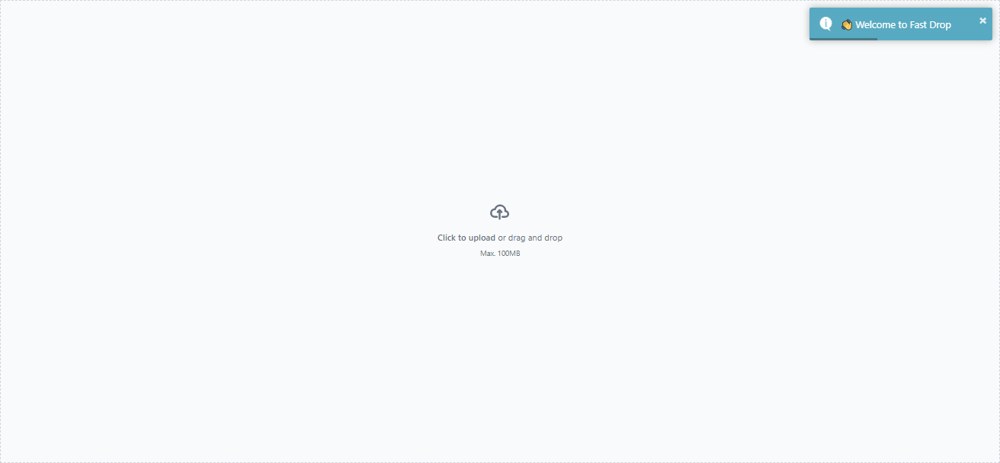
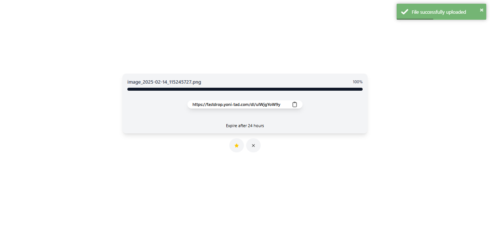
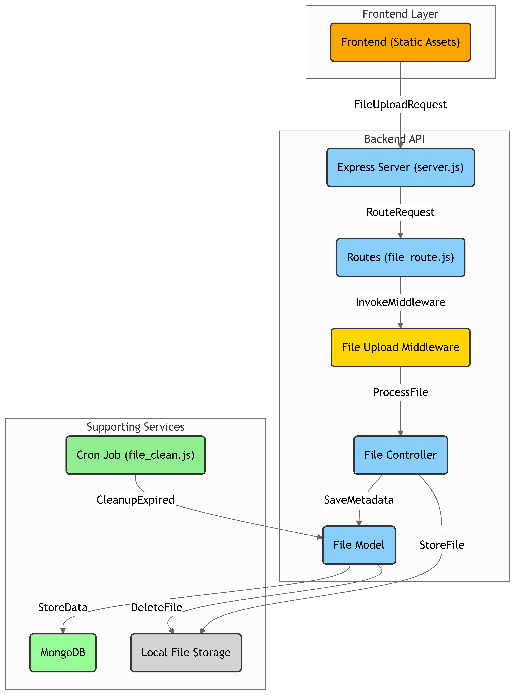

# FastDrop - Instant File Sharing Without Signup

🚀 **FastDrop** is a simple, fast, and secure **file-sharing service** built with **Node.js, Express, Mongoose, and Multer**. It allows users to **upload files** and get a **shareable download link** without signing up. Files expire automatically after **24 hours** to ensure privacy and save storage.

🔗 **Live Demo:** [FastDrop](https://fastdrop.yoni-tad.com)

 **Fast Drop | Home**
 **Fast Drop | Upload**

## 🚀 Features
- ✅ Upload files **without signup**
- ✅ Get a **unique shareable link**
- ✅ **Copy link** with a single click
- ✅ Auto-download when accessing the link
- ✅ Files **expire after 24 hours** for security
- ✅ Simple, clean **TailwindCSS frontend**

## 🛠️ Tech Stack
- **Backend:** Node.js, Express.js, Mongoose, Multer
- **Frontend:** TailwindCSS
- **Database:** MongoDB
- **File Storage:** Local (Can be expanded to Cloud storage)

## 📦 Installation & Setup

### 1. Clone the Repository
```bash
git clone https://github.com/yoni-tad/FastDrop.git
cd FastDrop
```

### 2. Install Dependencies
```bash
npm install
```

### 3. Set Up Environment Variables
Create a .env file in the root directory and add:
```bash
PORT=5000
MONGO_URI=your_mongodb_connection_string
```

### 4. Run the Server
```bash
npm start
```
The server will run on http://localhost:5000/

## Diagram

 **Fast Drop | Diagram**

## 🤝 Contributing
FastDrop is open-source, and contributions are welcome! To contribute:
- Fork the repo 🍴
- Create a new branch
- Make your changes
- Submit a Pull Request 🚀
